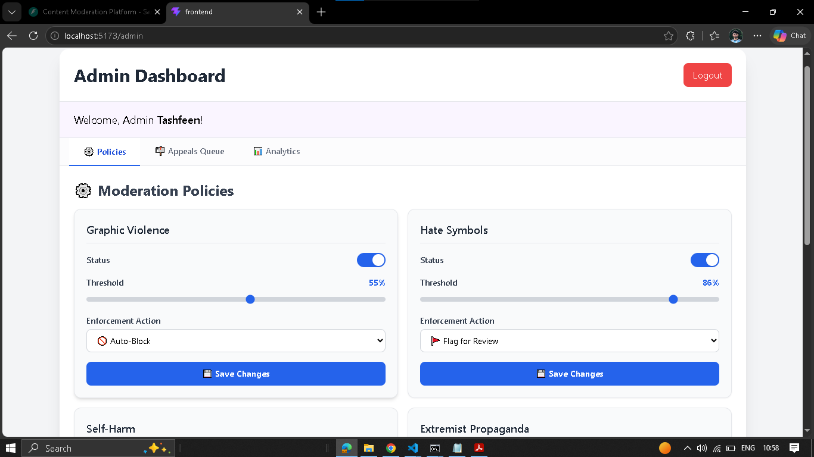
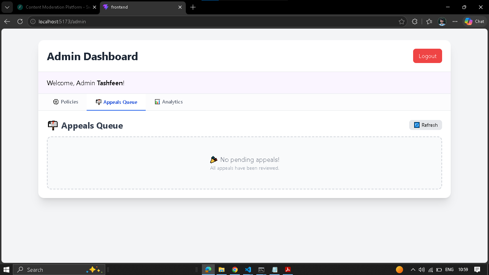
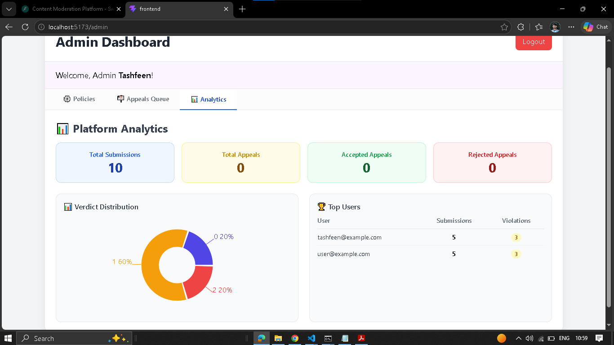
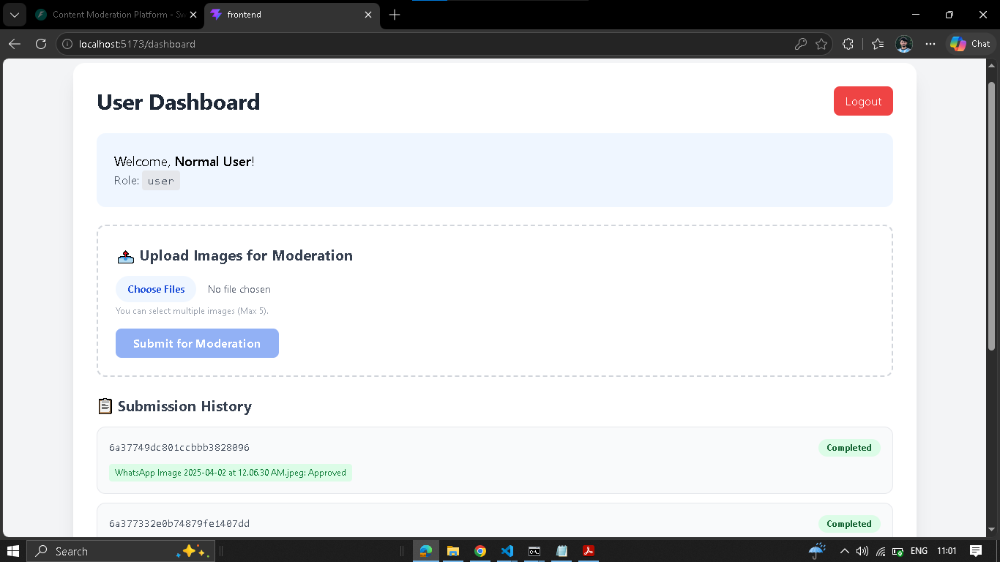

# 🛡️ AI Content Moderation Platform

A Full-Stack AI-powered Content Moderation System built with **FastAPI** (Python), **React** (JavaScript), and **MongoDB**.

## 🚀 Features

### 👤 User Features
- **JWT Authentication**: Secure login and registration.
- **Image Submission**: Upload one or multiple images (Max 5) for moderation.
- **Real-time Screening**: Background processing using a mock AI engine (6 moderation categories).
- **Submission History**: View all past submissions with verdict status (Approved, Flagged, Blocked).
- **Appeals**: File an appeal against Flagged/Blocked submissions with a justification.

### 🛠️ Admin Features
- **Policy Configuration**: Enable/Disable categories, set confidence thresholds (0-100%), and change enforcement actions (Auto-Block / Flag for Review).
- **Appeals Queue**: View pending appeals, review user justifications, accept/reject appeals with an optional admin response.
- **Analytics Dashboard**: Total submissions, verdict distribution (Pie Chart), appeal statistics, and user ranking.

---

## 🏗️ Architecture

### Tech Stack
- **Backend**: Python 3.10+, FastAPI, Motor (Async MongoDB), PyJWT, Bcrypt.
- **Frontend**: React 18, Vite, Tailwind CSS, Recharts, Axios.
- **Database**: MongoDB (Atlas or Local).

### Project Structure
```
AI-Content-Moderation-Platform/
├── backend/
│   ├── app/
│   │   ├── core/          # Config & DB connection
│   │   ├── models/        # Database models (User, Submission, etc.)
│   │   ├── routers/       # API routes (Auth, Submissions, Admin)
│   │   ├── schemas/       # Pydantic schemas (Request/Response validation)
│   │   ├── services/      # Business logic (Screening, Policies)
│   │   └── utils/         # Helpers (JWT, Password hashing, Dependencies)
│   ├── uploads/           # Stored images
│   ├── requirements.txt
│   └── .env
├── frontend/
│   ├── src/
│   │   ├── components/    (Currently inside App.jsx)
│   │   ├── App.jsx        # Main App with routing
│   │   ├── index.css      # Tailwind imports
│   │   └── main.jsx       # Entry point
│   ├── package.json
│   └── tailwind.config.js
└── README.md
```

---

## 🔧 Installation & Setup

### Prerequisites
- Python 3.10+
- Node.js 18+
- MongoDB (Atlas or Local)

### 1. Clone the Repository
```bash
git clone https://github.com/tashfeen786/AI-Content-Moderation-Platform.git
cd AI-Content-Moderation-Platform
```

### 2. Backend Setup
```bash
cd backend
python -m venv venv
source venv/bin/activate  # On Windows: venv\Scripts\activate
pip install -r requirements.txt
```

Create a `.env` file in the `backend` directory:
```env
MONGO_URI=mongodb+srv://<username>:<password>@cluster0.xxxxx.mongodb.net/
DB_NAME=moderation_db
SECRET_KEY=your-super-secret-key-here
```

Run the FastAPI server:
```bash
uvicorn app.main:app --reload --port 8000
```
API docs: `http://127.0.0.1:8000/docs`

### 3. Frontend Setup
```bash
cd frontend
npm install
npm run dev
```
App: `http://localhost:5173`

---

## 🔐 Default Users (for Testing)

| Role | Email | Password |
| :--- | :--- | :--- |
| **Admin** | `tashfeen@example.com` | `test123` |
| **User** | `user@example.com` | `user123` |

---

## 📸 Screenshots

| Page | Screenshot |
| :--- | :--- |
| User Dashboard |  |
| Admin Policies |  |
| Admin Appeals |  |
| Admin Analytics |  |

---

## 📄 License

MIT

## 👨‍💻 Author

**Tashfeen** - [GitHub](https://github.com/tashfeen786)
